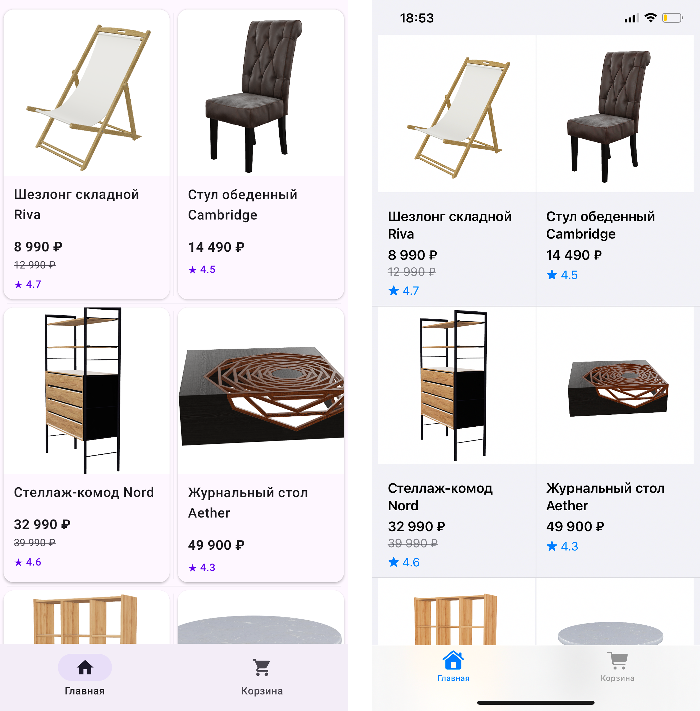
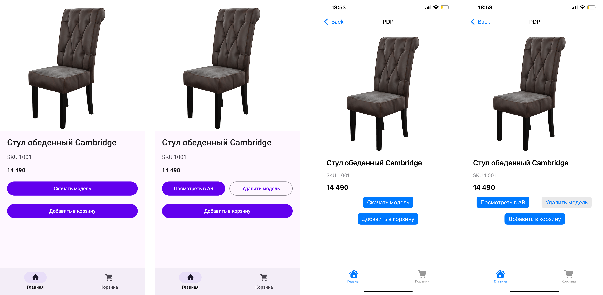
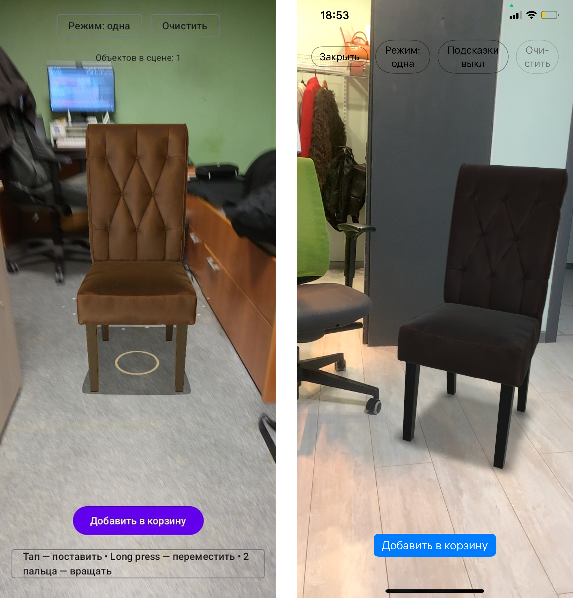
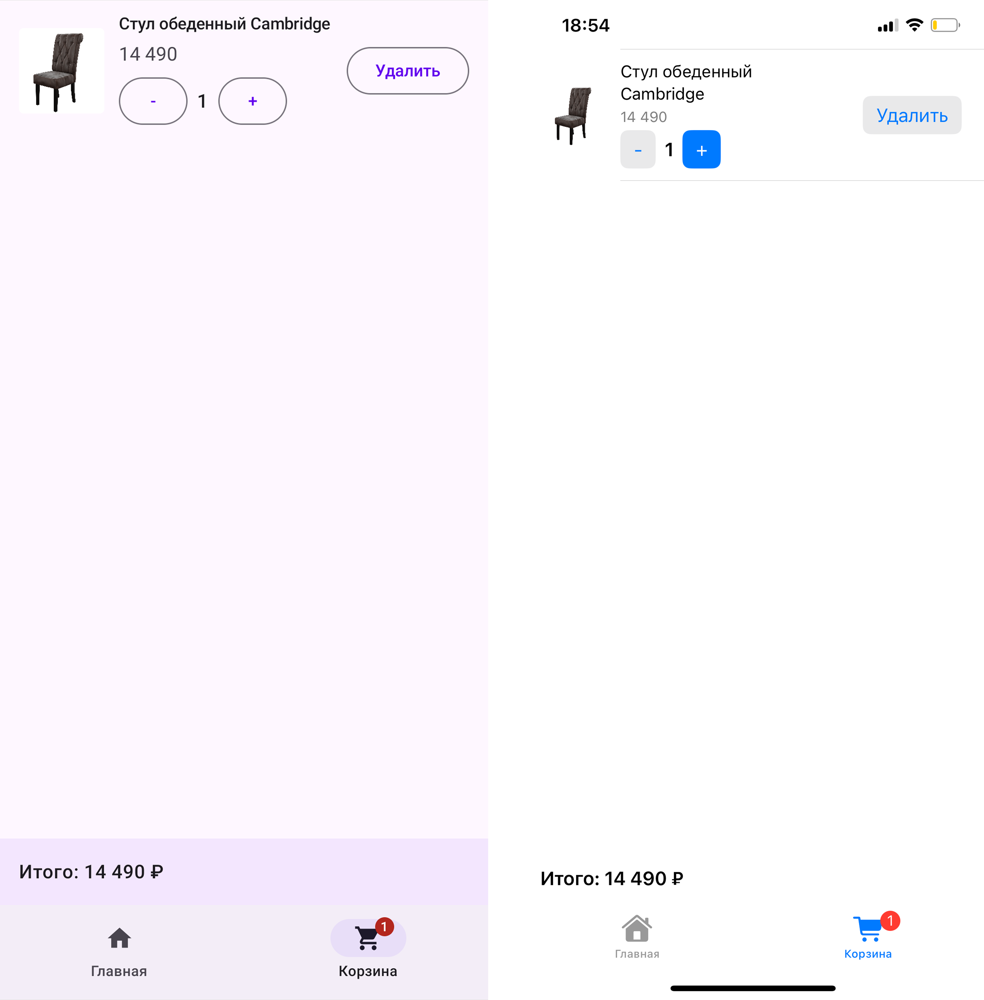
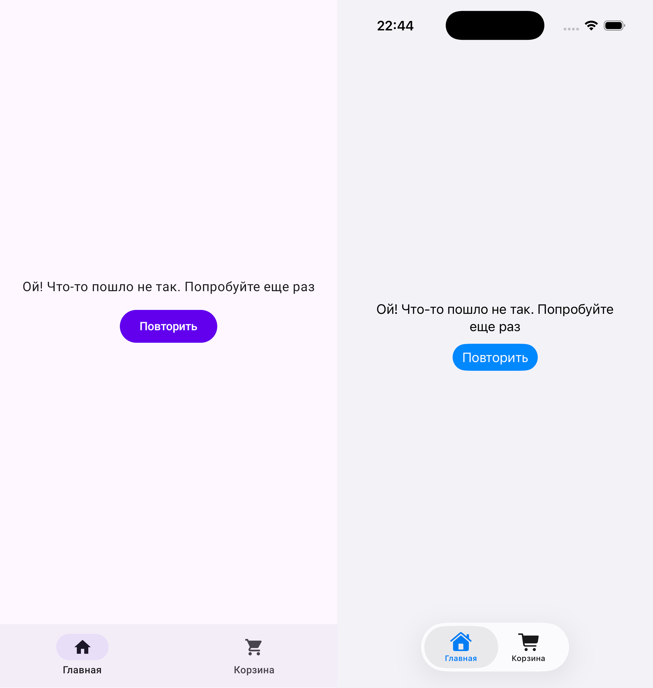
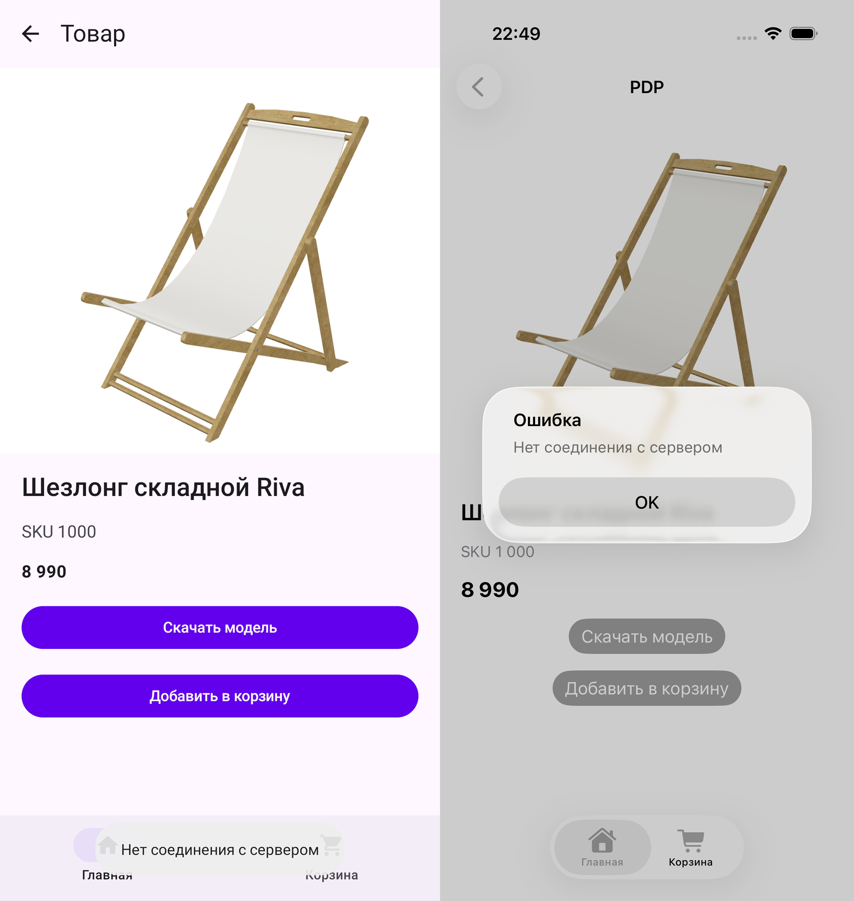
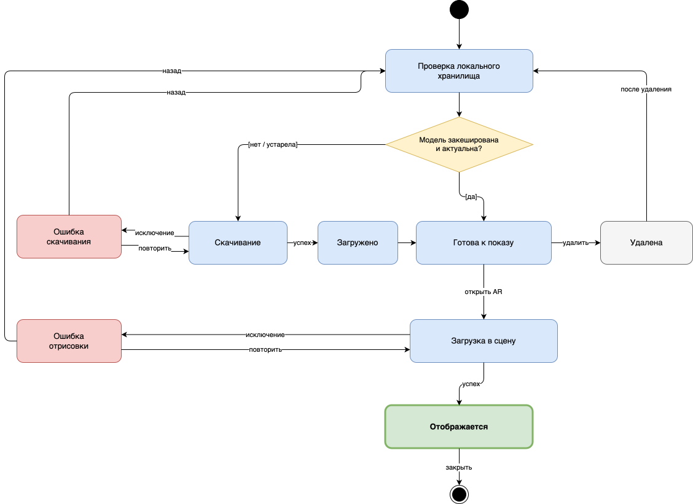
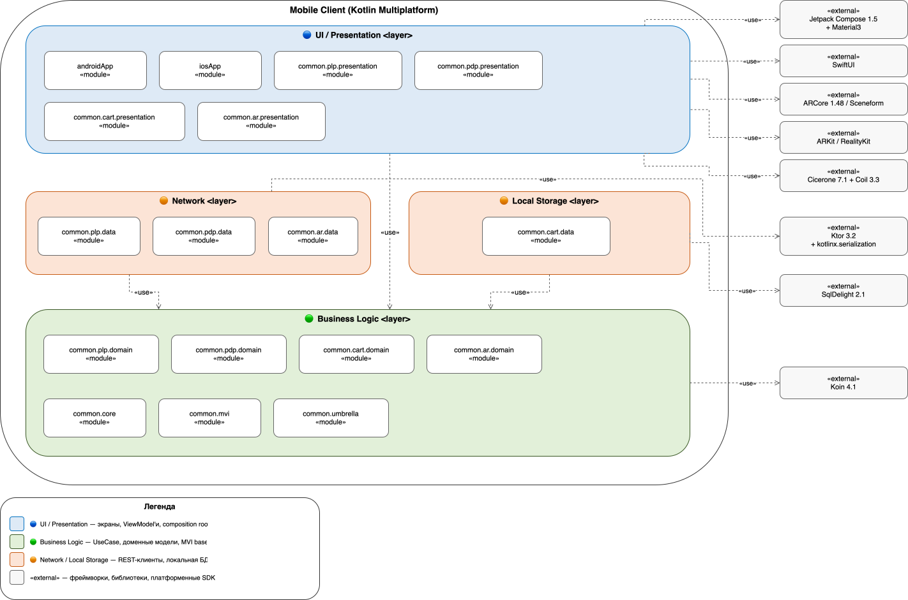

# E-Commerce AR App

Мобильное приложение электронной коммерции с предпросмотром товаров в дополненной реальности. Каталог, корзина, размещение 3D-моделей мебели в пространстве пользователя. Сделано на Kotlin Multiplatform: общая бизнес-логика, нативный UI на каждой платформе.

Дипломная работа. Тема — граница между shared-кодом KMP и платформенным AR-рендерингом: ARCore с Sceneform на Android, ARKit с RealityKit на iOS.

Серверная часть — в отдельном репозитории [`AREcommerceApi`](https://github.com/GlebPoroshin/AREcommerceApi).

[](https://kotlinlang.org/)
[](https://kotlinlang.org/docs/multiplatform-mobile-get-started.html)
[](https://www.android.com/)
[](https://www.apple.com/ios)
[](LICENSE)

## Скриншоты

| Каталог (PLP) | Карточка (PDP) | AR-размещение |
|:---:|:---:|:---:|
|  |  |  |
| Android слева, iOS справа | Загрузка модели, переход в AR | ARCore и RealityKit |

| Корзина | Ошибка сети на PLP | Ошибка загрузки модели |
|:---:|:---:|:---:|
|  |  |  |
| Счётчик на иконке и итог | Кнопка повторного запроса | Снекбар и диалог ошибки |

## Что внутри

**PLP.** Список товаров с пагинацией. Shimmer на загрузке, ретрай при сетевой ошибке. Compose на Android, SwiftUI на iOS.

**PDP.** Карточка товара. Галерея изображений: SVG на Android через Coil3, HD-растр на iOS. Цена со скидкой, кнопка добавления в корзину, переход в AR.

**AR.** Размещение 3D-моделей на горизонтальных и вертикальных поверхностях. Перемещение, поворот и масштаб жестами. Режим одного объекта и мульти-размещение. Форматы моделей: GLB (бинарный glTF) на Android, USDZ (Apple AR-формат) на iOS. Стек: ARCore 1.48 + Sceneform 1.23 на Android, ARKit + RealityKit на iOS 16+. Нужно физическое устройство, на симуляторе и эмуляторе AR не работает.

**Корзина.** Локальное хранилище SQLDelight, счётчик на иконке синхронизируется между экранами.

### Жизненный цикл 3D-модели



## Архитектура



Каждая фича разбита на три слоя: `domain` (модели и интерфейсы), `data` (DataSource, репозитории, мапперы), `presentation` (ViewModel + State/Event/Action).

```
common/
├── core/          конфигурация, NetworkError, DeviceIdProvider
├── mvi/           базовый SharedViewModel
├── plp/           список товаров
├── pdp/           карточка
├── ar/            AR-сцена и загрузка моделей
├── cart/          корзина на SQLDelight
└── umbrella/      DI-сборка на Koin
```

### MVI на SharedViewModel

```kotlin
class PlpViewModel(
    private val getPlpProductsUseCase: GetPlpProductsUseCase,
) : SharedViewModel<PlpState, PlpEvent, PlpAction>(
    initialState = PlpState.Loading,
) {
    override suspend fun handleEvent(event: PlpEvent) = when (event) {
        is PlpEvent.LoadProducts -> loadProducts(event.page)
        is PlpEvent.RetryLoad -> loadProducts(0)
    }

    private suspend fun loadProducts(page: Int) {
        updateState { copy(isLoading = true) }
        sendAction(PlpAction.ScrollToTop)
    }
}
```

Что отличает от типового MVVM:

- `viewState: StateFlow<S>` вместо `state`
- `viewAction: SharedFlow<A>` для одноразовых эффектов
- `onEvent` публичный, `handleEvent` абстрактный
- Других публичных методов у ViewModel нет
- State — sealed class (Loading / Content / Error), не data class с boolean-флагами

## Технологический стек

### KMP shared

| Библиотека | Версия | Зачем |
|---|---|---|
| Kotlin | 2.1.21 | Язык |
| Ktor Client | 3.2.3 | HTTP и кастомный DeviceID-плагин |
| Koin | 4.1.0 | DI |
| SQLDelight | 2.1.0 | Локальная БД корзины |
| KotlinX Serialization | 1.8.0 | JSON |
| MultiplatformSettings | 1.3.0 | Key-value хранилище |

### Android

| Компонент | Зачем |
|---|---|
| Jetpack Compose + Material3 | UI |
| ARCore 1.48 + Sceneform 1.23 | AR и GLTF-рендеринг |
| Coil3 3.3.0 | Картинки, включая SVG |
| Cicerone | Навигация |
| EncryptedSharedPreferences | Защищённое хранилище |

### iOS

| Компонент | Зачем |
|---|---|
| SwiftUI | UI, iOS 16+ |
| RealityKit + ARKit | AR и USDZ |
| URLSession | HTTP под Ktor |
| Keychain | Защищённое хранилище |

### Backend

- Tailscale Funnel — туннель HTTPS на локальный Spring Boot
- Кастомный Ktor-плагин подкладывает Device ID в заголовок каждого запроса
- Репозиторий сервера: [`AREcommerceApi`](https://github.com/GlebPoroshin/AREcommerceApi)

## Требования к сборке

### Android

- Android Studio Ladybug или новее, JDK 11+
- Android SDK 28 (minSdk в `build.gradle.kts`)
- Gradle 8.7.3, Kotlin 2.1.21
- Физическое устройство с актуальным ARCore (Settings → Google → ARCore)

### iOS

- Xcode 15 или новее
- iOS Deployment Target 16.0
- CocoaPods, подтягивается KMP-плагином
- Физический iPhone или iPad, Apple Developer Account
- RealityKit и ARKit на симуляторе не работают

### Общее

- macOS 12+
- Git 2.30+
- Tailscale CLI для локального бэкенда

## Сборка и запуск

Клонируем и подтягиваем зависимости:

```bash
git clone https://github.com/GlebPoroshin/E-Commerce-AR-app.git
cd E-Commerce-AR-app
./gradlew build
```

### Android

```bash
./gradlew :androidApp:installDebug
```

Можно открыть проект в Android Studio и запустить конфигурацию `androidApp` на физическом устройстве.

### iOS

KMP-фреймворк собирается автоматически при сборке iOS-приложения. Откройте `iosApp/iosApp.xcodeproj` в Xcode, выберите подписанный provisioning profile и запустите на устройстве.

Перед запуском убедитесь, что сервер `AREcommerceApi` доступен по URL из `BackendConfig` либо поднимите Tailscale Funnel локально.

## Лицензия

MIT, см. [LICENSE](LICENSE).
